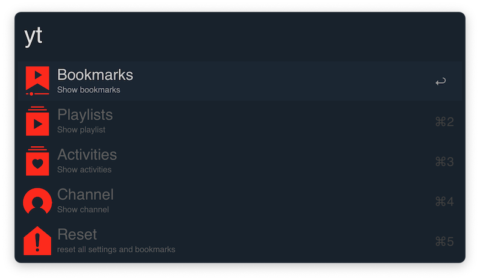

# alfred-youtube-bookmarks [](https://travis-ci.org/bikenik/alfred-youtube-bookmarks)

> youtube-bookmarks + dashboard [Safari]




## Install

```
$ npm install --global alfred-youtube-bookmarks
```
or as [ `youtube-bookmarks.alfredworkflow`](https://github.com/bikenik/alfred-youtube-bookmarks/releases)

*Requires [Node.js](https://nodejs.org) 7.6+ and the Alfred [Powerpack](https://www.alfredapp.com/powerpack/).*

> for use youtube API you need to create a project in Google Developers Console. It was explained in [this article](https://medium.com/@pablo127/google-api-authentication-with-oauth-2-on-the-example-of-gmail-a103c897fd98). For this workflow required 'Google Client ID' and 'Google Client Secret'.

> Bookmarks work without Google API.


## Usage

In Alfred, type `yt`, <kbd>Enter</kbd>, and your query.<br>
It will be work with Safari only.

#### Bookmarks
- To create bookmark needs to have opened Safari's window with youtube's video player active tab.
- type some shortcut (⌥⌘B - for example) to create bookmark
- type some shortcut (⌥⌘S - for example) to show and go through the bookmark in the current playing video.
- <kbd>fn+↵</kbd> to delete one or several bookmarks (in specific filters will be deleted all bookmarks in current filter)
- hit <kbd>⇧</kbd> To open preview window by the any bookmark.

<a href="https://www.buymeacoffee.com/cLMme6h" target="_blank"></a>

## License

MIT © [bikenik](http://bikenik.org)
